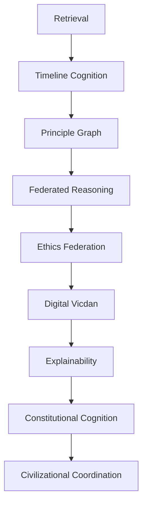

# Constitutional Cognition Stack

```mermaid
flowchart TD
A[Retrieval] --> B[Timeline Cognition]
B --> C[Principle Graph]
C --> D[Federated Reasoning]
D --> E[Ethics Federation]
E --> F[Digital Vicdan]
F --> G[Explainability]
G --> H[Constitutional Cognition]
H --> I[Civilizational Coordination]
```
